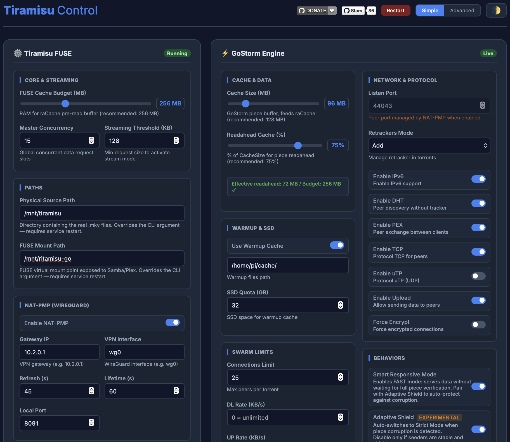
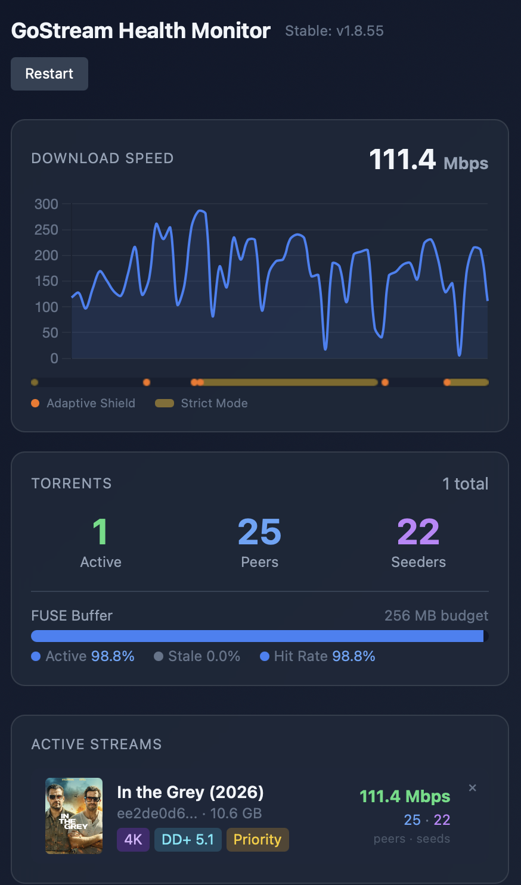

```
████████╗ ██╗ ██████╗   █████╗  ███╗   ███╗ ██╗ ███████╗ ██╗   ██╗
╚══██╔══╝ ██║ ██╔══██╗ ██╔══██╗ ████╗ ████║ ██║ ██╔════╝ ██║   ██║
   ██║    ██║ ██████╔╝ ███████║ ██╔████╔██║ ██║ ███████╗ ██║   ██║
   ██║    ██║ ██╔══██╗ ██╔══██║ ██║╚██╔╝██║ ██║ ╚════██║ ██║   ██║
   ██║    ██║ ██║  ██║ ██║  ██║ ██║ ╚═╝ ██║ ██║ ███████║ ╚██████╔╝
   ╚═╝    ╚═╝ ╚═╝  ╚═╝ ╚═╝  ╚═╝ ╚═╝     ╚═╝ ╚═╝ ╚══════╝  ╚═════╝
```

<h1 align="center" style="font-size:1rem; font-weight:600; border:none; margin:0;">Tiramisu</h1>

**The most advanced BitTorrent engine and FUSE virtual filesystem for live streaming to your private Plex/Jellyfin library. Forget Real-Debrid.**

[](https://deepwiki.com/MrRobotoGit/tiramisu)
[](https://hub.docker.com/r/mrrobotogit/tiramisu)
[](https://hub.docker.com/r/mrrobotogit/tiramisu)

> [!NOTE]
> This project used to be called GoStream. It is now Tiramisu, same project, same codebase, just a new name. Nothing about how it works has changed, and everything in this README still applies. If you are upgrading from an older install, note that the binary name, config paths, and systemd service name have all changed too, so a fresh run of the install script is the easiest way to pick up the new layout.

---

Tiramisu exposes a **custom FUSE virtual filesystem** where every `.mkv` file is a perfect illusion: it looks like a real file on disk, but every byte is served live from a BitTorrent swarm on demand. No downloading. No temp files. No storage quota.

The BitTorrent engine runs **inside the same OS process** as the FUSE layer, connected by an in-memory `io.Pipe()`. When Plex/Jellyfin reads a byte range, there is no HTTP round-trip, no serialization, no proxy overhead, just bytes, flowing directly from peers through RAM to the media server at full speed.

The result: **4K HDR Dolby Vision**, fully seekable, starting in 0.1 seconds, even on a **Raspberry Pi 4**.

This is not a torrent client with a media server bolted on. The FUSE filesystem *is* the product, custom-built from scratch around the constraints of torrent streaming: non-sequential byte-range requests, multi-gigabyte files that must be seekable at any position, and a Plex/Jellyfin scanner that probes every file in a library of hundreds of titles on startup.

### What's included

- **Custom FUSE virtual filesystem**: every `.mkv` is a live torrent presented to the media server as a real file. No temp files, no persistent downloads, torrent data never touches the disk.
- The embedded torrent engine is **GoStorm**, a fork of [TorrServer Matrix 1.37](https://github.com/YouROK/TorrServer) and [anacrolix/torrent v1.55](https://github.com/anacrolix/torrent), running in-process with the FUSE layer (no separate HTTP proxy). Both upstreams carry targeted streaming patches not present in the originals.
- **Built-in sync engine** discovers trending and popular titles from TMDB on a schedule, finds the best torrent via Prowlarr (with Torrentio fallback), and registers them automatically. All in pure Go, no Python, no external scripts. Existing entries are **upgraded** when a better version becomes available (e.g. 1080p → 4K HDR).
- **TV Series sync** runs on schedule with a fullpack-first season pack strategy and a Plex-compatible directory structure.
- Add a title to your **Plex cloud watchlist** and it shows up in your library within the hour.
- **NAT-PMP** for WireGuard setups: Tiramisu requests an inbound port mapping from the VPN gateway and installs `iptables REDIRECT` rules, all without a restart.
- A **peer blocklist** of ~700,000 IP ranges is downloaded on startup and refreshed every 24 hours, injected into the torrent engine before any connection is made.
- **Plex & Jellyfin Webhook integration**: `media.play` triggers Priority Mode with aggressive piece prioritization. IMDB-ID is extracted from the raw payload via regex, so it works even when the media server sends localized titles. Jellyfin is supported natively via JSON body, no code change, no plugin hacks.
- The **embedded Control Panel** at `:9080/control` lets you adjust all FUSE and engine settings live, compiled directly into the binary.
- The **Health Monitor Dashboard** at `:9080/dashboard` shows a real-time speed graph, an active stream panel with movie poster and quality badges, sync controls, and system stats, all embedded in the Go binary.
- **Adaptive Chunk Size** keeps playback smooth on any file, any bitrate, without manual tuning: the buffer scales itself to what the file actually needs instead of using one fixed size for everything.
- **AdaptiveShield** automatically balances speed against data integrity: it runs fast by default and only slows down to verify data more strictly when it detects a peer sending bad data, then relaxes again once the swarm proves clean.
- **TailHedge** kills the specific kind of stutter caused by a single slow peer holding up the exact byte the player needs right now, by quietly asking a second peer for the same data and using whichever arrives first.
- **PEXChurn** speeds up cold starts by dropping peers that turn out to be useless for the file you are actually watching, freeing connection slots for peers that can actually help.
- Everything ships as a **single binary**: GoStorm engine, Tiramisu, metrics, control panel, and webhook receiver in one `tiramisu` executable.

---
## Control Panel



---

## Table of Contents

- [The Setup: Tiramisu + Plex/Jellyfin/Infuse on Apple TV](#the-setup-tiramisu--plex--infuse-on-apple-tv)
- [How the Magic Works](#how-the-magic-works)
- [AI Tiramisu Pilot - Experimental](https://github.com/MrRobotoGit/tiramisu/blob/main/ai/docs/ai-pilot.md)
- [Architecture](#architecture)
- [Core Engineering](#core-engineering)
- [Performance](#performance)
- [Requirements](#requirements)
- [Quick Install](#quick-install)
- [How-To Guide](#how-to-guide)
- [Control Panel](#tiramisu-control-panel)
- [Health Monitor](#health-monitor-dashboard)
- [Configuration Reference](#configuration-reference)
- [Sync Engine](#sync-engine-go-native)
- [Prowlarr Integration](#prowlarr-integration-resilience)
- [Plex/Jellyfin & Samba Setup](#plex-and-samba-setup)
- [Build from Source](#build-from-source)
- [Docker](#docker)
- [API Reference](#api-quick-reference)
- [FAQ](#faq)
- [Troubleshooting](#troubleshooting)
- [Donate](#support)
- [License](#license)

---

## The Setup: Tiramisu + Plex/Jellyfin/Infuse on Apple TV

> Not a developer? This section explains what you actually get and why it works so well.


**The end result**: you open Infuse on your Apple TV, your entire movie library appears with posters and metadata, you press Play on a 4K Dolby Vision film and it starts in under a second. No buffering. No "downloading...". No subscription to Real-Debrid or any external service. Everything runs on a single board computer or any always-on Linux box in your home.

### How the three pieces fit together

**Tiramisu** runs on your Linux device, a Raspberry Pi, a NAS, a VPS, or any always-on machine. It creates a virtual hard drive that looks completely real to the rest of your network: it contains thousands of `.mkv` files, each the correct size, each seekable. In reality, none of those files exist on disk. When anything reads a byte, Tiramisu silently fetches it in real-time from the BitTorrent network and passes it through.

**Plex** (or **Jellyfin**, or any media server) sees this virtual hard drive as a normal media library. It scans the files, downloads posters and descriptions from the internet, tracks what you've watched, and makes everything available on your home network, just like it would with a real NAS.

**Infuse** on Apple TV connects to your Plex/Jellyfin library and plays the files using Direct Play: it reads the video stream directly from the file, with no conversion or re-encoding. This is why it handles 4K HDR Dolby Vision effortlessly, even though it is coming from a torrent in real time.

Because Tiramisu exposes standard `.mkv` files on a standard filesystem, any player or media server that can read a network share works: Plex, Jellyfin, Emby, Kodi, VLC, mpv, or anything else. No plugins, no special configuration.

### How your library gets populated automatically

Tiramisu includes a built-in sync engine that runs on a schedule and keeps your library up to date without any manual intervention.

Every day, the engine queries **TMDB** (The Movie Database) for the latest releases, trending titles, and popular movies. For each title it finds, it searches **Prowlarr** (with Torrentio fallback) for the best available torrent (preferring 4K Dolby Vision, falling back to 1080p). If a good torrent is found, it registers it in GoStorm and creates the corresponding virtual `.mkv` file in the library.

The next time the media server scans, it finds a new file, downloads the poster and description, and the film appears in your library ready to play.

If a better version of a film becomes available later (for example a 4K HDR release of a title you already have in 1080p), the engine replaces it automatically.

TV series work the same way: the sync engine finds new seasons and episodes, organises them in the Plex/Jellyfin-compatible folder structure (`Show Name (Year)/Season.01/`), and they appear in your library within the week.

You can also add a title to your **Plex Watchlist** from any device and it will appear in your library within the hour.
### Prowlarr Integration (Resilience)

To ensure the system remains functional even when public aggregators like Torrentio are down, Tiramisu includes a **Prowlarr Adapter**. This allows you to use your own self-hosted Prowlarr instance as the primary source for torrents.

The sync engine implements a **Strict Fallback** logic: it first queries your Prowlarr indexers using IMDB IDs for maximum precision. If no results are found locally, it automatically falls back to Torrentio.

**Configuration** is done via `config.json` (or the Control Panel → **Prowlarr Indexer** section):

```json
"prowlarr": {
  "enabled": true,
  "api_key": "your-api-key",
  "url": "http://192.168.1.x:9696"
}
```

See the [Prowlarr Adapter Documentation](docs/prowlarr-adapter.md) for technical details.


### 100% local, no subscriptions

Tiramisu has no external dependency at playback time. No third-party service, no monthly fee, no data leaving your home. Your library is always available, even without an internet connection, and it never disappears because a remote service went down.

### Why Infuse starts in under a second

When you press Play, Infuse immediately reads the beginning and end of the file to load the video index and seek tables. On a real hard drive this is instant. Tiramisu replicates this with an **SSD warmup cache**: the first 64 MB and last few MB of every file are pre-cached on the Pi's SSD during the initial Plex/Jellyfin library scan. By the time you press Play, those bytes are already on disk and Infuse gets them in milliseconds.


### Why your library survives a reboot

Every file on a real filesystem has a permanent ID called an **inode**. Plex/Jellyfin and Infuse use these IDs to recognize files across restarts, so they know "this is the same film I scanned last week" and do not re-download metadata or reset your watch history.

On a standard virtual filesystem, these IDs are random and change every time the system restarts. Tiramisu solves this by persisting a permanent inode map to a SQLite database (`STATE/tiramisu.db`). After a reboot, every virtual `.mkv` gets back the exact same ID it had before. To Plex/Jellyfin and Infuse, it is indistinguishable from a file that never moved.

### When you press Play: the full chain

1. You press Play on Infuse (Apple TV) -> Infuse requests the file from Plex/Jellyfin
2. Plex/Jellyfin reads the file from Tiramisu's virtual filesystem
3. Plex or Jellyfin sends a webhook to Tiramisu: "user started playing *this* film"
4. Tiramisu identifies the torrent from the IMDB ID and switches to **Priority Mode**: all bandwidth focuses on the film you are watching, background activity is paused
5. Bytes flow: BitTorrent peers -> Tiramisu RAM -> Plex/Jellyfin -> Infuse -> your TV
6. If you seek, Tiramisu jumps directly to that position in the torrent with no re-buffering from the start

---

## How the Magic Works

Plex/Jellyfin reads `/mnt/tiramisu-mkv-virtual/movies/Interstellar.mkv`. From Plex/Jellyfin's perspective, it's a normal 55 GB file on a local disk. In reality, the file does not exist. The FUSE kernel module intercepts the read, calls into Tiramisu, and Tiramisu serves the exact bytes from a three-layer cache, backed by a live BitTorrent swarm.

| Layer | What | Size | Purpose |
|-------|------|------|---------|
| **L1** | In-memory Read-Ahead | 256 MB | 32-shard concurrent buffer with per-shard LRU |
| **L2** *(optional)* | SSD Warmup Head | 64 MB/file | Instant TTFF on repeat playback, served at 150–200 MB/s from SSD |
| **L3** *(optional)* | SSD Warmup Tail | 16 MB/file | MKV Cues (seek index), Plex/Jellyfin probes the end of every file before confirming playback |

What makes this non-trivial: a FUSE filesystem that backs a real directory of static files is straightforward. A FUSE filesystem that must handle non-sequential byte-range requests across hundreds of files, each backed by an independent torrent with variable peer availability, while a Plex/Jellyfin scanner hammers every inode in parallel: that required building every subsystem from scratch.

---

## Architecture

```
BitTorrent Peers ←→ GoStorm Engine (:8090)
                         │
              Native Bridge (In-Memory Pipe)
              Zero-Network, Zero-Copy Hot Path
                         │
         ┌───────────────────────────────────┐
         │       Tiramisu FUSE Layer         │
         │  L1: Read-Ahead Cache (256 MB)    │
         │  L2: SSD Warmup Head (64 MB/file) │
         │  L3: SSD Warmup Tail (16 MB/file) │
         └───────────────────────────────────┘
                         │
         /mnt/tiramisu-mkv-virtual/*.mkv  (FUSE mount)
                         │
         Samba share (smbd, oplocks=no, vfs objects=fileid)
                         │
         Synology CIFS mount (serverino, vers=3.0)
                         │
         Plex/Jellyfin Media Server libraries
```

### Port Map

| Port | Purpose |
|------|---------|
| `:8090` | GoStorm API, JSON torrent management |
| `:9080` | Control Panel, Metrics, Dashboard, Webhook, Scheduler |

---

## Core Engineering

> **11 purpose-built subsystems**, each solving a real problem encountered during development on Raspberry Pi 4 hardware.

### 1. Zero-Network Native Bridge

Tiramisu runs as a **single process**: GoStorm engine and Tiramisu FUSE compiled into one binary. When Plex/Jellyfin reads a `.mkv` byte range, the FUSE layer calls directly into GoStorm via an in-memory `io.Pipe()`: no TCP round-trip, no HTTP header parsing, no serialization, no proxy overhead. Metadata operations are direct Go function calls. This eliminates the network RTT that causes stuttering in every HTTP-based torrent streaming proxy on constrained hardware.

### 2. Two-Layer SSD Warmup Cache *(optional)*

An optional SSD cache that improves performance for repeat playback. It can be enabled and configured in the Control Panel → GoStorm settings, and is independent of the core streaming path. Tiramisu works without it, just with a longer cold-start time.

When enabled, the **head cache** stores the first 64 MB of each file on SSD on first play. On repeat playback, TTFF drops to **< 0.01 s** (SSD reads at 150–200 MB/s, compared to 2–4 s for cold torrent activation).

The **tail cache** stores the last 16 MB separately. MKV files keep their Cues (seek index) near the end, and Plex/Jellyfin probes that region before confirming playback. Without tail cache, the seek bar may render as unavailable on first open.

The default quota is 32 GB with LRU eviction by write time, enough for around 150 films. Media server library scans read the first 1 MB of every file, which is enough to populate the head cache automatically, no manual warming needed.

### 3. Webhook Integration & Smart Streaming

Tiramisu embeds a webhook receiver at `:9080/plex/webhook` (also `/webhook`). Both **Plex** and **Jellyfin** are supported. When a `media.play` event arrives:

1. **IMDB extraction**: Extracts the IMDB ID from the raw JSON payload using `imdb://(tt\d+)` regex *before* `json.Unmarshal`. This is intentional: Plex uses a non-standard `Guid` array format that causes a silent `UnmarshalTypeError` when decoded normally.
2. **Priority Mode**: GoStorm is instructed to aggressively prioritize pieces covering the exact byte range being played.
3. **Tail freeze**: The MKV Cues segment is not evicted while the film is playing.
4. **Fast-drop on stop**: Torrent retention shrinks from 60 s to 10 s, freeing peers immediately.

> 💡 **Why IMDB-ID?** Media servers send titles in the user's display language (`"den stygge stesøsteren"` instead of `"The Ugly Stepsister"`). Fuzzy matching fails. IMDB ID is language-independent.

**Plex**: Settings → Webhooks → Add Webhook:
```
http://<your-pi-ip>:9080/plex/webhook
```

**Jellyfin**: Install the [Webhook plugin](https://github.com/jellyfin/jellyfin-plugin-webhook), then add one webhook with events `PlaybackStart`, `PlaybackStop`, `PlaybackProgress`:

| Field | Value |
|-------|-------|
| URL | `http://<your-pi-ip>:9080/plex/webhook` |
| Header Key | `Content-Type` |
| Header Value | `application/json` |

Template:
```
{"event":"{{NotificationType}}","Metadata":{"title":"{{{Name}}}","grandparentTitle":"{{{SeriesName}}}","librarySectionType":"{{ItemType}}","guid":"imdb://{{Provider_imdb}}","Guid":[{"id":"imdb://{{Provider_imdb}}"}]}}
```

Tiramisu normalizes Jellyfin's native event names (`PlaybackStart`→`media.play`, `PlaybackStop`→`media.stop`) and item types (`Movie`→`movie`, `Episode`→`show`) internally.

### 4. Adaptive Responsive Shield

Two read modes, automatically managed:

| Mode | Behavior | When |
|------|----------|------|
| **Responsive** *(default)* | Data served before SHA1 verification, instant start | Normal operation |
| **Strict** | Only SHA1-verified pieces served | Automatically activated on corruption detection |

When a corrupt piece is detected (`MarkNotComplete()`), the Adaptive Shield switches to Strict Mode until a clean streak is confirmed, then automatically restores Responsive. The required clean streak escalates each time Strict re-triggers within the same playback session: 30 s the first time, 60 s the second, 90 s the third, 120 s from the fourth on. This escalation resets only on a genuine stop (`media.stop`), not on Plex-internal seeks or buffering probes, so a swarm that keeps sending bad pieces gets progressively more scrutiny instead of resetting to the same short timer every time. The mode transition uses an atomic boolean, so there is no mutex contention on the hot read path.

### 5. Seek-Master Architecture

Accurate, low-latency seeking in large 4K files required five coordinated fixes:

| Fix | What it does |
|-----|-------------|
| **Eager offset update** | Updates `lastOff` before the cache check, pump sees target on the same `Read()` call |
| **Atomic pipe interrupt** | `Interrupt()` closes the pipe reader atomically when the player jumps > 256 MB, instant unblock from `io.ReadFull` |
| **Reactive jump** | If player is > 256 MB ahead of pump, snap to `(playerOff / chunkSize) * chunkSize` |
| **Pump survival** | Pump survives `ErrInterrupted` via 200 ms sleep-and-continue, no goroutine restart overhead |
| **Tail probe detection** | Plex/Jellyfin's end-of-file MKV Cues probes served from SSD tail cache without steering the pump |

### 6. 32-Shard Read-Ahead Cache

The 256 MB read-ahead budget is split across **32 independent shards**, each keyed by hash of file path and offset, each with its own LRU and mutex. Multiple Plex/Jellyfin sessions and scanner threads read concurrently without contending on a single lock. Both `Put()` and `Get()` use **defensive copies** to prevent use-after-free races from channel-pool reuse.

### 7. Native Sync Engine (Go)

All sync logic runs natively inside the Go binary, no Python, no external scripts, no subprocess overhead.

| Engine | Trigger | What it does |
|--------|---------|-------------|
| **Movies** | Scheduler / manual | TMDB Discover + Popular → Prowlarr/Torrentio → GoStorm → virtual `.mkv` |
| **TV Series** | Scheduler / manual | TV series with fullpack-first approach, episode registry |
| **Watchlist** | Scheduler / manual | Plex cloud watchlist → IMDB → Prowlarr/Torrentio → GoStorm |

**Quality ladder**: `4K DV > 4K HDR10+ > 4K HDR > 4K > 1080p REMUX > 1080p`\
**Minimum seeders**: 15 (main sync), 10 (watchlist sync, for older films)

All sync state (episode registry, negative caches, scheduler state) is persisted in `STATE/tiramisu.db` (SQLite). The built-in scheduler replaces system cron and is configurable from the Control Panel.

### 8. NAT-PMP Native VPN Port Forwarding

When BitTorrent traffic is routed through a WireGuard VPN, the home router's port forwarding rules are bypassed by the tunnel. Tiramisu runs a NAT-PMP sidecar that periodically requests a TCP+UDP port mapping from the VPN gateway, installs `iptables PREROUTING REDIRECT` rules, and updates GoStorm's listen port, all without a restart.

### 9. IP Blocklist ~700k Ranges

Tiramisu downloads a gzipped BGP/country blocklist on startup and refreshes it every 24 hours. The ranges are injected directly into anacrolix/torrent's IP filter, so known-bad actors are blocked before any connection attempt.

### 10. Profile-Guided Optimization (PGO)

The binary is compiled with `-pgo=auto`. Go 1.24 reads `default.pgo` to inline hot paths and optimize branch prediction using real production profiling data. On Pi 4 Cortex-A72 (no hardware AES/SHA1), PGO alone accounts for **~5–7% CPU reduction**.

### 11. GoStorm Engine Deep Fork of TorrServer Matrix + anacrolix/torrent

GoStorm is a fork of **[TorrServer Matrix 1.37](https://github.com/YouROK/TorrServer)** (BitTorrent management layer) and **[anacrolix/torrent v1.55](https://github.com/anacrolix/torrent)** (peer protocol engine). Both upstreams have been patched extensively for streaming correctness and performance, fixes that are not present in the original projects:

<details>
<summary><b>Click to expand: 15+ targeted optimizations</b></summary>

| Optimization | Problem → Solution |
|---|---|
| **O(1) `AddTorrent` DB write** | Original rewrote all 520 torrents on every add (O(N) fsync). Fixed to single `tdb.Set()`. |
| **O(1) `GetTorrentDB`** | Original called `ListTorrent()` + 520 unmarshals to find one torrent. Fixed to direct key lookup. |
| **InfoBytes + PeerAddrs caching** | `TorrentSpec.InfoBytes` was never persisted, re-activation required full metadata fetch. Now saved on `Wake()`. |
| **Request rebuild debounce** | 300 rebuilds/s reduced to 60 → **5x CPU reduction**. |
| **O(1) `clearPriority`** | Original iterated all ~512 cached pieces with global lock. Replaced with `localPriority` map tracking ~25 active pieces. |
| **4 MB MemPiece buffer zeroing** | Channel pools reused buffers without zeroing → stale data from different files caused forward-jump corruption. Fixed with `clear(p.buffer)`. |
| **raCache defensive copies** | `Get()` returned sub-slices of pooled buffers. On eviction, Plex/Jellyfin received overwritten data. Fixed with copies on `Put()` and `Get()`. |
| **`cleanTrigger` panic fix** | `Cache.Close()` closed the channel while goroutines could still send → panics during peer upload. Fixed with separate `cleanStop` channel. |
| **`PeekTorrent` discipline** | Monitoring endpoints using `GetTorrent()` caused silent torrent activation loops. All monitoring paths now use `PeekTorrent()`. |
| **InodeMap GC fix** | Inode cleanup pruned virtual MKV stubs every 5 min (529 files). Fixed to use `WalkDir(physicalSourcePath)`. |
| **8 additional race condition fixes** | Concurrent map writes, torn reads, nil pointer dereferences across `requesting.go`, `piece.go`, `cache.go`, `apihelper.go`. |

</details>

---

## Performance

> Measurements on **Raspberry Pi 4** (4 GB RAM, Cortex-A72, arm64, no hardware crypto), the minimum supported baseline. Performance is higher on amd64 or more powerful arm64 hardware.

| Metric | Value |
|--------|-------|
| Cold start (first play, no warmup) | 2–4 s |
| Warm start (SSD warmup HIT) | **0.1–0.5 s** |
| Seek latency (cached position) | **< 0.01 s** |
| CPU at 4K HDR streaming | **20–23%** of one core |
| CPU reduction vs. baseline | **−87%** (161% → 20%) |
| Binary size | **33 MB** (60% smaller than legacy builds) |
| Memory footprint (read-ahead) | Deterministic 256 MB |
| GOMEMLIMIT | 2200 MiB |
| Peak throughput (fast seeder) | **400+ Mbps** |
| Plex/Jellyfin scan peer count | ~6 total (was ~15,000 before fix) |
| Inode shard count | 32 (collision-protected) |
| Warmup cache capacity | ~150 films at 64 MB each (32 GB) |

---

## Requirements

| Component | Details |
|-----------|---------|
| **Hardware** | Any `linux/amd64` or `linux/arm64` device, **Raspberry Pi 4 is the minimum tested baseline** (4 GB RAM recommended). Runs on NAS, VPS, mini-PC, or any always-on Linux box. |
| **Go** | 1.24+ (`linux/amd64` or `linux/arm64`), do **not** use the 32-bit `linux/arm` toolchain |
| **FUSE 3** | `sudo apt install fuse3 libfuse3-dev` |
| **systemd** | For service management |
| **Samba** | `sudo apt install samba` |
| **Plex/Jellyfin** | Media Server (on Synology or any network host) |
| **TMDB API key** | Free at [themoviedb.org/settings/api](https://www.themoviedb.org/settings/api) |
| **Plex token** | Settings → Account → XML API |

---

## Quick Install

```bash
curl -fsSL https://raw.githubusercontent.com/MrRobotoGit/tiramisu/main/install.sh -o install.sh
chmod +x install.sh
./install.sh
```


The interactive installer handles everything end-to-end:
1. Installs system dependencies (`fuse3`, `libfuse3-dev`, `gcc`, `samba`, `git`)
2. Prompts for all required paths, Plex credentials, TMDB key, and NAT-PMP settings
3. Generates `config.json` from `config.json.example`
4. Creates `Tiramisu/STATE/`, `logs/`, and FUSE mount point directories
5. **Compiles the Tiramisu binary** (downloads Go if needed, detects architecture automatically)
6. Writes and enables the systemd service for `tiramisu`

Once complete:

```bash
sudo systemctl start tiramisu
```

---

## How-To Guide

> [!CAUTION]
> **Attention:** After the first run of the Movie and TV sync engine, hundreds of `.mkv` files will be created. Plex/Jellyfin will then begin scanning these files to populate its UI. During this initial scan, playback will be extremely slow or may time out. This is because the media server opens and closes files hundreds of times during analysis, which congests the BitTorrent engine. Please wait for Plex/Jellyfin to complete its scan before starting any streams. Enjoy!


<details>
<summary><b>Step 1: Configure the Webhook (Plex or Jellyfin)</b></summary>

Required for Priority Mode (bitrate boost during playback), fast-drop on stop, and IMDB-ID-based file matching.

**Plex**: Settings → Webhooks → Add Webhook:
```
http://192.168.1.2:9080/plex/webhook
```

**Jellyfin**: Install the Webhook plugin, add one webhook (events: `PlaybackStart`, `PlaybackStop`, `PlaybackProgress`):
- URL: `http://192.168.1.2:9080/plex/webhook`
- Header: Key `Content-Type` / Value `application/json`
- Template:
```
{"event":"{{NotificationType}}","Metadata":{"title":"{{{Name}}}","grandparentTitle":"{{{SeriesName}}}","librarySectionType":"{{ItemType}}","guid":"imdb://{{Provider_imdb}}","Guid":[{"id":"imdb://{{Provider_imdb}}"}]}}
```

Test connectivity:
```bash
curl -X POST http://192.168.1.2:9080/plex/webhook \
  -H 'Content-Type: application/json' \
  -d '{"event":"media.play"}'
```

</details>

<details>
<summary><b>Step 2: Configure the Plex/Jellyfin Library</b></summary>

Add a Movies library in Plex/Jellyfin pointing to the Samba share:
```
smb://192.168.1.2/tiramisu-mkv-virtual/movies
```
Or, if using Synology, point Plex/Jellyfin to the CIFS mount: `/volume1/Tiramisu/movies`.

Run a library scan after adding the library. Plex/Jellyfin reads the first megabyte of every `.mkv` file during the scan, this automatically populates the SSD warmup head cache for every title. Subsequent plays will start in under 0.5 seconds.

</details>

<details>
<summary><b>Step 3: Add Your First Movie</b></summary>

**Manually via API:**
```bash
curl -X POST http://127.0.0.1:8090/torrents \
  -H "Content-Type: application/json" \
  -d '{"action":"add","link":"magnet:?xt=urn:btih:...","title":"Interstellar (2014)"}'
```

**Via sync engine (recommended):**
Trigger from the Control Panel (`:9080/control`) → Sync Scheduler → Movies → "Run now", or via API:
```bash
curl -X POST http://127.0.0.1:9080/api/scheduler/movies/run
```
The engine fetches popular films from TMDB, finds the best available torrent for each via Prowlarr/Torrentio, adds them to GoStorm, and writes virtual `.mkv` stub files.

</details>

<details>
<summary><b>Step 4: Watch a Film (What Happens Internally)</b></summary>

```
1. Plex/Jellyfin requests /mnt/tiramisu-mkv-virtual/movies/Interstellar.mkv
2. FUSE Open() triggers Wake(), GoStorm activates the torrent
3. Plex/Jellyfin metadata probes → served from SSD warmup cache if enabled, otherwise from the torrent pump
4. Plex/Jellyfin probes MKV Cues at end → served from SSD tail cache if enabled
5. Plex or Jellyfin sends media.play webhook → Tiramisu activates Priority Mode
6. Streaming reads → served from Read-Ahead Cache or Native Bridge pump
7. Playback begins (0.1–0.5 s with warmup, 2–4 s cold) ✨
```

</details>

<details>
<summary><b>Step 5: Seek in 4K</b></summary>

When Plex/Jellyfin seeks to a new timestamp:

1. `Read()` is called at the new offset, `lastOff` is updated immediately
2. If the jump exceeds 256 MB: `Interrupt()` closes the pipe, pump goroutine unblocks atomically
3. Pump detects `lastOff` is > 256 MB ahead, snaps to aligned chunk position
4. Pump restarts via `startStream(newOff)`, GoStorm repositions torrent reader
5. Data arrives from peers or SSD cache within seconds

The pump goroutine survives `ErrInterrupted`, it sleeps 200 ms and continues the read loop, so no goroutine restart overhead.

</details>

<details>
<summary><b>Step 6: Add from Your Plex Watchlist</b></summary>

Add any movie to your Plex cloud watchlist (desktop or mobile app). Within the interval configured in the Scheduler (default: 1 hour), the Go sync engine will resolve it to an IMDB ID, find the best torrent, and add it automatically.

Trigger manually from the Control Panel (`:9080/control`) → Sync Scheduler → Watchlist → "Run now", or via API:
```bash
curl -X POST http://127.0.0.1:9080/api/scheduler/watchlist/run
```

The engine:
1. Queries `discover.provider.plex.tv` for your watchlist
2. Resolves each entry to an IMDB ID (falls back to TMDB)
3. Queries Prowlarr/Torrentio for the best stream (minimum 10 seeders)
4. Adds to GoStorm and writes a virtual `.mkv` stub

</details>

<details>
<summary><b>Step 7: Monitor in Real Time</b></summary>

```bash
# Control Panel, Tiramisu + GoStorm settings, paths, scheduler, restart button
open http://192.168.1.2:9080/control

# Health Dashboard, speed graph, torrent stats, active stream, system stats
open http://192.168.1.2:9080/dashboard

# Raw metrics (JSON)
curl -s http://192.168.1.2:9080/metrics | python3 -m json.tool

# Scheduler status
curl -s http://192.168.1.2:9080/api/scheduler/status | jq

# Live log key events only
ssh pi@192.168.1.2 "tail -f /home/pi/Tiramisu/logs/tiramisu.log | grep -E '(OPEN|NATIVE|Interrupt|Jump|DiskWarmup|Emergency)'"

# Active torrents in RAM with speed
curl -s -X POST -H 'Content-Type: application/json' \
  -d '{"action":"active"}' http://192.168.1.2:8090/torrents | \
  jq '.[] | {title: .title[:60], speed_mbps: ((.download_speed//0)/1048576|round), peers: (.active_peers//0)}'
```

</details>

<details>
<summary><b>Step 8: Configure the MKV Creation Scheduler</b></summary>

Tiramisu includes a built-in scheduler that replaces system cron. Configure it from the Control Panel at `:9080/control` → **Sync Scheduler** card.

**Three jobs are available:**

| Job | Default schedule | Log file |
|-----|-----------------|----------|
| Movies Library Sync | Mon + Thu at 03:00 | `logs/movies-sync.log` |
| TV Series Libraries Sync | Wed + Fri at 04:00 | `logs/tv-sync.log` |
| Plex Watchlist Sync | Every 1 hour | `logs/watchlist-sync.log` |

Enable the scheduler with the **Enable Scheduler** toggle, pick weekdays and start time for each job, then click **Save schedule**. Changes require a service restart to take effect.

> **Run now**: trigger any job immediately from the Control Panel or via `POST /api/scheduler/{type}/run` on port 9080.

</details>

<details>
<summary><b>Step 9: Tune GoStorm Settings</b></summary>

Via the Control Panel at `:9080/control`, or via API:

```bash
curl -X POST http://127.0.0.1:8090/settings \
  -H "Content-Type: application/json" \
  -d '{
    "action": "set",
    "sets": {
      "CacheSize": 100663296,
      "ReaderReadAHead": 95,
      "PreloadCache": 0,
      "ConnectionsLimit": 25,
      "TorrentDisconnectTimeout": 10,
      "UseDisk": true,
      "ResponsiveMode": true
    }
  }'
```

| Setting | Value | Rationale |
|---------|-------|-----------| 
| `CacheSize` | 96 MB | Lean engine strategy, feed FUSE 256 MB buffer; smaller heap = lower GC. 64 MB caused buffering in testing. |
| `ConnectionsLimit` | 25 | Matches FUSE master semaphore; prevents Samba thread exhaustion |
| `ResponsiveMode` | `true` | Serve unverified data; Adaptive Shield corrects corruption automatically |
| `UseDisk` | `true` | Enable SSD warmup cache |
| `TorrentDisconnectTimeout` | 10 s | Fast peer cleanup for RAM footprint |

</details>

<details>
<summary><b>Step 10: Regenerate the PGO Profile</b></summary>

Capture a CPU profile during real streaming workload:

```bash
# Single profile (120 seconds while streaming a 4K film)
curl -o /home/pi/tiramisu/default.pgo \
  "http://127.0.0.1:9080/debug/pprof/profile?seconds=120"

# Or merge multiple workloads for better coverage
curl -o /tmp/pgo-stream.pprof "http://127.0.0.1:9080/debug/pprof/profile?seconds=120"
curl -o /tmp/pgo-sync.pprof   "http://127.0.0.1:9080/debug/pprof/profile?seconds=120"
go tool pprof -proto /tmp/pgo-stream.pprof /tmp/pgo-sync.pprof > /home/pi/tiramisu/default.pgo

# Rebuild Go detects the changed profile and re-optimizes automatically
cd /home/pi/tiramisu
GOARCH=arm64 CGO_ENABLED=1 /usr/local/go/bin/go build -pgo=auto -o tiramisu .
```

Regenerate after significant code changes. On Pi 4 Cortex-A72, `sha1.blockGeneric` in the profile is expected: the A72 has no hardware SHA1 extensions.

</details>

---

## Tiramisu Control Panel

The Control Panel is a web UI **embedded in the Tiramisu binary**: no additional server, no React build step, no external dependencies. Served at `:9080/control`.

```
http://<your-pi-ip>:9080/control
```

### Simple / Advanced Mode

A toggle in the top-right corner switches between two views:

- **Simple**: Most frequently changed settings: read-ahead budget, concurrency, cache size, paths, and NAT-PMP toggle
- **Advanced**: All tunable parameters, split into labelled groups across two panels

### Tiramisu FUSE Panel (left)

Settings are written to `config.json` and require a **service restart**. The **Restart** button in the header triggers an immediate restart.

| Group | Settings |
|-------|----------|
| **Core & Streaming** | ReadAhead Budget (MB), Master Concurrency, Max Streaming Slots, Streaming Threshold (KB) |
| **Paths** | Physical Source Path (Samba root), FUSE Mount Path |
| **Prowlarr Indexer** | Enable Prowlarr, API Key, URL |
| **Media Manager (Plex)** | TMDB API Key, Plex URL, Plex Token, Movies Library ID, Series TV Library ID |
| **Connectivity & Rescue** | GoStorm URL, Rescue Grace/Cooldown, Metrics Port, Log Level, Tiramisu Port, BlockList URL |

### GoStorm Engine Panel (right)

Settings are pushed **live via API**: no restart needed. **Apply All Core Settings** sends values immediately.

| Group | Settings |
|-------|----------|
| **Cache & Data** | Cache Size (MB), Readahead Cache (%), Preload Cache (%) |
| **Warmup & SSD** | Use Warmup Cache, Warmup path, SSD Quota (GB), Head Warmup (MB) |
| **Swarm Limits** | Connections Limit, DL/UP Rate (KB/s), Disconnect Timeout (s) |
| **Network & Protocol** | Listen Port, Retrackers Mode, IPv6/DHT/PEX/TCP/uTP/Upload/Force Encrypt |
| **NAT-PMP (WireGuard)** | Enable, Gateway IP, VPN Interface, Refresh/Lifetime (s), Local Port |
| **Behaviors** | Smart Responsive Mode, Debug Log |

---

## Health Monitor Dashboard

<p align="center"></p>

Embedded Go service at port **`:9080`**. Real-time operational view of the entire stack.

```
http://<your-pi-ip>:9080/dashboard
```

### Status Grid

Six cards in a 2×3 grid:

| Card | What it shows |
|------|--------------| 
| **GOSTORM** | API ping latency (green = responding). Restart button. |
| **FUSE MOUNT** | Number of virtual `.mkv` files currently exposed. |
| **VPN (WG0)** | WireGuard interface status: VPN IP and gateway. |
| **NAT-PMP** | Active external port assigned by VPN gateway. |
| **PLEX** | Server version and reachability. |
| **SYSTEM** | CPU %, RAM %, free disk space, live via gopsutil. |

### Download Speed Graph

**15-minute rolling chart** of GoStorm download speed in Mbps. Samples every 5 seconds with auto-scroll.

### Active Stream Panel

Appears automatically during playback:
- 🎬 **Movie poster** (fetched from TMDB)
- 🏷️ **Quality badges**: `PRIORITY`, `4K`, `DV`, `ATMOS`, `HDR10+`
- 📡 **LIVE indicator** + 5-minute average speed
- 👥 **Peer/seeder count** for the active torrent

### Sync Controls

Two panels for manual sync execution without SSH:
- **MOVIES SYNC**: Triggers the Go movie sync engine with live log streaming
- **TV SYNC**: Triggers the Go TV sync engine with Start/Idle status

### MKV Creation Scheduler

Built into the Go binary. Configured from the **Sync Scheduler** card in the Control Panel:
- **Movies Library Sync**: select weekdays + start time
- **TV Series Libraries Sync**: select weekdays + start time
- **Plex Watchlist Sync**: interval-based (1 h, 2 h … 24 h)

Last/next run times and live status are shown in the card. State persists across restarts in `STATE/tiramisu.db`.

---

## Configuration Reference

`config.json` is resolved relative to the binary's path (`os.Executable()`). No path argument needed. Not tracked by git (contains credentials).

```bash
cp config.json.example /home/pi/Tiramisu/config.json
nano /home/pi/Tiramisu/config.json
```

### Full Field Reference

| Field | Default | Description |
|-------|---------|-------------|
| `physical_source_path` | *(none)* | Directory where virtual `.mkv` stubs are created |
| `fuse_mount_path` | *(none)* | FUSE mount point, seekable virtual files served here |
| `read_ahead_budget_mb` | `256` | In-memory read-ahead budget |
| `disk_warmup_quota_gb` | `32` | SSD cache quota (~150 films at 64 MB each) |
| `warmup_head_size_mb` | `64` | Per-file SSD warmup size |
| `master_concurrency_limit` | `25` | Max concurrent data slots |
| `gostorm_url` | `http://127.0.0.1:8090` | GoStorm internal API URL |
| `proxy_listen_port` | `8080` | Tiramisu FUSE HTTP port |
| `metrics_port` | `9080` | Metrics, Control Panel, Webhook port |
| `blocklist_url` | *(BT_BlockLists)* | Gzipped IP blocklist URL (24 h refresh) |
| `plex.url` | *(none)* | Plex server URL |
| `plex.token` | *(none)* | Plex authentication token |
| `plex.library_id` | `0` | Plex movies library section ID |
| `plex.tv_library_id` | `0` | Plex TV series library section ID (0 = disabled) |
| `tmdb_api_key` | *(none)* | TMDB API key |
| `prowlarr.enabled` | `false` | Use Prowlarr as primary indexer (falls back to Torrentio if disabled) |
| `prowlarr.api_key` | *(none)* | Prowlarr API key (Settings → General → API Key) |
| `prowlarr.url` | *(none)* | Prowlarr base URL (e.g. `http://192.168.1.x:9696`) |
| `natpmp.enabled` | `false` | Enable NAT-PMP |
| `natpmp.gateway` | *(none)* | VPN gateway IP |
| `natpmp.vpn_interface` | `wg0` | WireGuard interface |

### Runtime Environment Variables

```ini
Environment="GOMEMLIMIT=2200MiB"
Environment="GOGC=100"
```

`GOMEMLIMIT=2200MiB` leaves headroom for OS and Samba on a 4 GB Pi 4.

---

## Sync Engine (Go Native)

All sync logic runs natively inside the Go binary. No Python, no external scripts, no subprocess overhead. Configure schedules from the Control Panel at `:9080/control` → **Sync Scheduler**.

### Movies Sync

Queries TMDB Discover + Popular (Italian + English, region IT+US), evaluates Prowlarr/Torrentio results, adds the best torrent.

Trigger from Control Panel → Sync Scheduler → Movies → "Run now", or via API:
```bash
curl -X POST http://127.0.0.1:9080/api/scheduler/movies/run
```

- Quality: `4K DV > 4K HDR10+ > 4K HDR > 4K > 1080p REMUX > 1080p`
- Min seeders: 15 · Min size: 10 GB (4K), 4 GB (1080p)
- Skips existing films (by TMDB ID) · Upgrades lower-quality entries

### TV Sync

```bash
curl -X POST http://127.0.0.1:9080/api/scheduler/tv/run
```

Fullpack-first approach, prefers complete season packs. Plex/Jellyfin-compatible directory structure:
```
Show Name (Year)/
  Season.01/
    Show.Name_S01E01_<hash8>.mkv
    Show.Name_S01E02_<hash8>.mkv
```

### Watchlist Sync

```bash
curl -X POST http://127.0.0.1:9080/api/scheduler/watchlist/run
```

Reads Plex cloud watchlist → IMDB ID resolution → Prowlarr/Torrentio (min 10 seeders) → GoStorm.

---

## Plex/Jellyfin and Samba Setup

### Samba Configuration

Critical parameters in `/etc/samba/smb.conf` to prevent FUSE deadlocks during Plex/Jellyfin library scans:

```ini
[tiramisu-mkv-virtual]
   path = /mnt/tiramisu-mkv-virtual
   browseable = yes
   read only = yes
   oplocks = no           # CRITICAL: prevents kernel exclusive locks on FUSE files
   aio read size = 1      # CRITICAL: forces async I/O, prevents smbd D-state
   deadtime = 15          # cleans inactive SMB connections every 15 minutes
   vfs objects = fileid   # CRITICAL: transmits 64-bit inodes to Synology/Plex/Jellyfin
```

> [!WARNING]
> **`oplocks = no` is non-negotiable.** With oplocks enabled, the kernel requests exclusive locks on FUSE-backed files, causing `smbd` threads to enter D-state indefinitely during concurrent Plex/Jellyfin scans.

> [!IMPORTANT]
> **`vfs objects = fileid`** ensures 64-bit inode transmission. Without it, Synology receives truncated 32-bit inodes, causing Plex to misidentify files.

### Synology CIFS Mount

```
Source:  //pi-ip/tiramisu-mkv-virtual
Target:  /volume1/Tiramisu
Options: serverino,vers=3.0,uid=1024,gid=100,file_mode=0777,dir_mode=0777
```

`serverino` must remain active. Synology may silently drop it after network timeouts. Schedule a Task Scheduler job (every 5 min) to verify and remount if needed.

---

## Build from Source

> [!IMPORTANT]
> Compile natively on the target machine. Do not cross-compile: the PGO profile must match the target CPU architecture.

```bash
ssh pi@192.168.1.2
cd /home/pi/tiramisu

/usr/local/go/bin/go clean -cache
/usr/local/go/bin/go mod tidy
GOARCH=arm64 CGO_ENABLED=1 /usr/local/go/bin/go build -pgo=auto -o tiramisu .

# Deploy
sudo systemctl stop tiramisu
cp tiramisu /home/pi/Tiramisu/tiramisu
sudo systemctl start tiramisu
```

**Verify the toolchain is 64-bit:**
```bash
/usr/local/go/bin/go version
# Required: go version go1.24.x linux/arm64
# Wrong:    go version go1.24.x linux/arm   <-- 32-bit
```

**Install Go 1.24 if needed:**
```bash
wget https://go.dev/dl/go1.24.0.linux-arm64.tar.gz
sudo tar -C /usr/local -xzf go1.24.0.linux-arm64.tar.gz
```

---

## Docker

> [!IMPORTANT]
> Tiramisu mounts a FUSE filesystem at startup. Docker blocks this syscall by default. The container requires elevated privileges to run.

Pre-built images for `linux/amd64` and `linux/arm64` are published automatically on every release to Docker Hub and GitHub Container Registry:

| Registry | Image |
|----------|-------|
| **Docker Hub** | `mrrobotogit/tiramisu:latest` |
| **GHCR** | `ghcr.io/mrrobotogit/tiramisu:latest` |

**Pull:**

```bash
docker pull mrrobotogit/tiramisu:latest
# or
docker pull ghcr.io/mrrobotogit/tiramisu:latest
```

**Run:**

```bash
docker run -d \
  --name tiramisu \
  --device /dev/fuse \
  --cap-add SYS_ADMIN \
  --cap-add NET_ADMIN \
  -v /path/to/config.json:/config.json:ro \
  -v /mnt/tiramisu-mkv-real:/mnt/tiramisu-mkv-real \
  -v /mnt/tiramisu-mkv-virtual:/mnt/tiramisu-mkv-virtual \
  -p 8090:8090 \
  -p 9080:9080 \
  mrrobotogit/tiramisu:latest
```

Or use `--privileged` as a simpler alternative to the individual capabilities (e.g. on a Raspberry Pi where the container is fully trusted).

`config.json` must be volume-mounted at `/config.json` (the default `MKV_PROXY_CONFIG_PATH`). Use `config.json.example` as the starting point.

**Build from source** (from the repository root):

```bash
docker build -f docker/Dockerfile -t tiramisu .
```

### Windows Docker Installer

For Windows users, a dedicated installer generates a ready-to-use [Dockge](https://github.com/louislam/dockge) stack with Tiramisu + Plex **or** Jellyfin in a single container:

👉 **[docker-windows/](https://github.com/MrRobotoGit/tiramisu/tree/main/docker-windows)**

- Run `docker-windows\install-rebuild.bat` for interactive setup (flavor, paths, ports)
- Auto port conflict resolution
- Idempotent rebuild: never deletes existing media or config data

> **Requires:** Docker Desktop with WSL2 (Linux containers) and FUSE support (`/dev/fuse` available inside containers).

---

## API Quick Reference

### GoStorm API (`:8090`)

```bash
# List all torrents (count)
curl -s -X POST -H 'Content-Type: application/json' \
  -d '{"action":"list"}' http://127.0.0.1:8090/torrents | jq length

# Add a torrent
curl -X POST -H 'Content-Type: application/json' \
  -d '{"action":"add","link":"magnet:?xt=urn:btih:...","title":"Film Title (Year)"}' \
  http://127.0.0.1:8090/torrents

# Active torrents (in RAM, not DB)
curl -s -X POST -H 'Content-Type: application/json' \
  -d '{"action":"active"}' http://127.0.0.1:8090/torrents | \
  jq '.[] | {title: .title[:50], speed_mbps: ((.download_speed//0)/1048576|round), peers: (.active_peers//0)}'

# Read settings
curl -s -X POST -H 'Content-Type: application/json' \
  -d '{"action":"get"}' http://127.0.0.1:8090/settings | jq

# Remove a torrent
curl -X POST -H 'Content-Type: application/json' \
  -d '{"action":"rem","hash":"<infohash>"}' http://127.0.0.1:8090/torrents
```

### Tiramisu Metrics API (`:9080`)

```bash
# Full metrics
curl -s http://127.0.0.1:9080/metrics | jq

# Key fields
curl -s http://127.0.0.1:9080/metrics | \
  jq '{version, uptime, read_ahead_active_bytes, config_source}'
```

---

## FAQ

**What is Tiramisu?**
Tiramisu is a self-hosted BitTorrent engine with a built-in FUSE virtual filesystem. It presents torrents as normal, seekable `.mkv` files to Plex or Jellyfin, and streams the bytes live from the swarm as they are read, with no download step and no temp files.

**How is this different from Real-Debrid or other debrid services?**
Debrid services are third-party paid subscriptions that cache torrents on someone else's servers and hand you an HTTP link. Tiramisu runs entirely on hardware you own, no subscription, no third-party server, no monthly fee. You get the same "instant playback" experience, but the BitTorrent swarm itself is the source, not a rented cache.

**Does Tiramisu store or download the files?**
No persistent copy of the media is kept. Byte ranges pass through RAM (and an optional bounded SSD cache limited to the first/last few MB of each file, purely to speed up the first seconds of playback) and are never written to disk as complete files. There is no storage quota to plan around because there is nothing to store.

**Do I need to seed or keep uploading?**
Tiramisu participates in the swarm like any BitTorrent client while a file is open, but retention drops automatically once playback stops, and no long-term seeding is required or expected.

**What hardware do I need?**
A Raspberry Pi 4 (4 GB RAM) is the tested minimum baseline, and it comfortably handles 4K HDR streaming. Any `linux/amd64` or `linux/arm64` machine works: NAS, VPS, mini-PC, or any always-on Linux box.

**Does it work with Sonarr, Radarr, or other *Arr tools?**
Not directly. Tiramisu has its own built-in sync engine that talks to TMDB, Prowlarr, and Torrentio to discover and add titles automatically, so it does not need the *Arr suite to function. There is currently no compatibility layer for those tools specifically.

**Is this legal?**
Tiramisu is a general-purpose BitTorrent engine and streaming filesystem. It does not host, index, or distribute any copyrighted content itself; what you do with it is your responsibility, same as with any BitTorrent client.

**Is my data private?**
Everything runs on your own hardware. No account, no third-party API key is required for the core engine to work (TMDB, Prowlarr, and Plex/Jellyfin integrations are optional and use your own credentials).

---

## Troubleshooting

<details>
<summary><b>Plex shows buffering or "Playback Error"</b></summary>

Check warmup cache:
```bash
curl -s http://127.0.0.1:9080/metrics | jq '.read_ahead_active_bytes'
```

If empty, force a Plex/Jellyfin library scan. The scan reads the first MB of each file and populates the SSD head warmup.

Check active torrent status:
```bash
curl -s -X POST -H 'Content-Type: application/json' \
  -d '{"action":"active"}' http://127.0.0.1:8090/torrents | \
  jq '.[] | {title: .title[:50], speed_mbps: ((.download_speed//0)/1048576|round), peers: (.active_peers//0)}'
```

If peer count < 3 and you are routing through WireGuard, check NAT-PMP configuration.

</details>

<details>
<summary><b>smbd D-state or Samba hangs during Plex/Jellyfin scan</b></summary>

Almost always one of three causes:

1. **`oplocks = no` missing** from `smb.conf`: kernel acquires exclusive locks on FUSE files, smbd blocks indefinitely
2. **`vfs objects = fileid` missing**: Synology receives truncated 32-bit inodes
3. **`serverino` dropped** on Synology CIFS mount: check with `mount | grep tiramisu`

Check for D-state processes:
```bash
ps aux | grep -E 'smbd|tiramisu|fuse' | awk '$8 == "D"'
```

</details>

<details>
<summary><b>Few seeders or slow downloads</b></summary>

If you are routing BitTorrent traffic through WireGuard, enable NAT-PMP to restore inbound port reachability through the VPN gateway:
```json
"natpmp": {
  "enabled": true,
  "gateway": "10.2.0.1",
  "vpn_interface": "wg0"
}
```

Without an open inbound port, peers cannot initiate connections. The engine relies solely on outbound connections. If you are not using a VPN, configure port forwarding on your router instead.

</details>

<details>
<summary><b>Service fails to start</b></summary>

```bash
sudo systemctl status tiramisu
tail -30 /home/pi/logs/tiramisu.log
```

If the FUSE mount is stale:
```bash
fusermount3 -uz /mnt/tiramisu-mkv-virtual
sudo systemctl start tiramisu
```

Ensure mount point exists:
```bash
sudo mkdir -p /mnt/tiramisu-mkv-virtual
sudo chown pi:pi /mnt/tiramisu-mkv-virtual
```

</details>

<details>
<summary><b>Webhook not triggering Priority Mode (Plex or Jellyfin)</b></summary>

Verify connectivity:
```bash
curl -v http://127.0.0.1:9080/plex/webhook \
  -X POST -H 'Content-Type: application/json' \
  -d '{"event":"media.play","Metadata":{"librarySectionType":"movie","guid":"imdb://tt1234567","Guid":[{"id":"imdb://tt1234567"}]}}'
```

Check logs:
```bash
grep -i webhook /home/pi/logs/tiramisu.log | tail -20
```

If the connection appears in logs but IMDB matching fails, verify the raw payload contains `imdb://tt\d+`. Tiramisu uses regex on the raw JSON string, so it works even with localized titles.

**Jellyfin-specific**: if you see no log entry at all, confirm the `Content-Type` header is set correctly (Key: `Content-Type`, Value: `application/json`). Jellyfin does not send the request when the Content-Type override is malformed.

</details>

<details>
<summary><b>High CPU usage</b></summary>

Profile the live binary:
```bash
go tool pprof -top "http://127.0.0.1:9080/debug/pprof/profile?seconds=30"
```

Expected hot paths: `sha1.blockGeneric` (no crypto extensions on Pi 4 A72), `io.ReadFull`, `sync.(*Mutex).Lock`. Regenerating the PGO profile typically reduces CPU 5–7%.

</details>

---

## Key File Locations

Paths below use the defaults set by `install.sh`. All are configurable during installation.

**Runtime (install directory, default `~/Tiramisu/`)**

| Path | Purpose |
|------|---------|
| `~/Tiramisu/tiramisu` | Production binary |
| `~/Tiramisu/config.json` | Live configuration (edit → `sudo systemctl restart tiramisu`) |
| `~/Tiramisu/STATE/tiramisu.db` | SQLite state database: inode map, sync caches, episode registry, scheduler state |
| `~/Tiramisu/logs/` | All service logs (`tiramisu.log`, `movies-sync.log`, `tv-sync.log`, `watchlist-sync.log`) |
| `/mnt/tiramisu-mkv-virtual/` | FUSE mount point (served to Plex/Jellyfin -> Samba) |
| `/etc/systemd/system/tiramisu.service` | systemd service definition |

**Build (cloned repository, default `~/tiramisu/`)**

| Path | Purpose |
|------|---------|
| `~/tiramisu/` | Git clone & build directory |
| `~/tiramisu/default.pgo` | PGO profile, regenerate after major code changes |

---

## Support

Tiramisu is free and open source. If it's saving you a monthly chip, consider fueling the engine!

[](https://github.com/sponsors/MrRobotoGit)

---

## License

GNU General Public License v2.0
